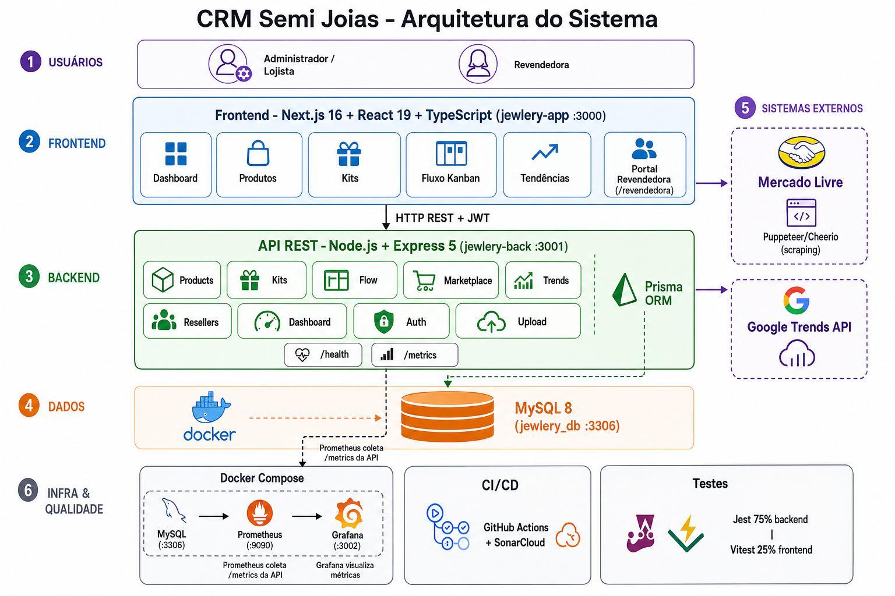
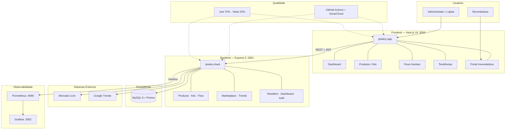

# CRM para Semi Joias com Motor de Recomendação Baseado em Tendências de Mercado

**Autor:** João Vitor Colombo  
**Curso:** Engenharia de Software  
**Data:** Junho/2026  

---

## Resumo

Este projeto apresenta o desenvolvimento de um CRM especializado para o setor de semi joias, integrado a um módulo inteligente de recomendação que analisa tendências do mercado e apoia a montagem de kits comerciais. A solução utiliza **Next.js 16**, **Node.js/Express 5**, **Prisma** e **MySQL** para entregar uma aplicação web moderna, com gestão de estoque, fluxo comercial em Kanban, portal da revendedora e integração com dados reais do Mercado Livre e Google Trends.

**Documentação técnica detalhada:**

- [Frontend (`jewlery-app/README.md`)](./jewlery-app/README.md)
- [Backend (`jewlery-back/README_BACKEND.md`)](./jewlery-back/README_BACKEND.md)

---

## Como executar o projeto

### Pré-requisitos

- Node.js 20+
- Docker (opcional, para MySQL)
- npm

### 1. Banco de dados

```bash
docker compose up -d
```

### 2. Backend

```bash
cd jewlery-back
npm install
npx prisma generate
npx prisma migrate dev
npm run seed:auth      # usuário demo: demo@demo / demo
npm run dev
```

API em `http://localhost:3001` — variáveis em `jewlery-back/.env` (ver README do backend).

### 3. Frontend

```bash
cd jewlery-app
# Crie .env.local com NEXT_PUBLIC_API_URL=http://localhost:3001
npm install
npm run dev
```

Aplicação em `http://localhost:3000`

### 4. Testes unitários

```bash
# Backend (meta: 75% de cobertura)
cd jewlery-back
npm run test:coverage

# Frontend (meta: 25% de cobertura)
cd jewlery-app
npm run test:coverage
```

### 5. Observabilidade (Prometheus + Grafana)

Com a API rodando em `localhost:3001`:

```bash
docker compose up -d prometheus grafana
```

| Serviço    | URL                          | Credenciais   |
|-----------|------------------------------|---------------|
| Prometheus | http://localhost:9090        | —             |
| Grafana    | http://localhost:3002        | admin / admin |
| Métricas API | http://localhost:3001/metrics | —          |
| Health     | http://localhost:3001/health  | —             |

### 6. SonarCloud (CI)

1. Crie um projeto em [SonarCloud](https://sonarcloud.io) e ajuste `sonar.organization` em `sonar-project.properties`  
2. Adicione o secret `SONAR_TOKEN` no repositório GitHub  
3. O workflow `.github/workflows/ci.yml` executa testes + análise estática em cada push/PR  

### Estrutura do monorepo

```
jew/
├── jewlery-app/          # Frontend Next.js
├── jewlery-back/         # API Express + Prisma
├── docker-compose.yml    # MySQL + Prometheus + Grafana
├── monitoring/           # Config Prometheus/Grafana
├── sonar-project.properties
├── .github/workflows/    # CI + SonarCloud
└── README.md             # Este documento
```

---

# 1. Introdução

## Contexto
O mercado de semi joias é dinâmico, competitivo e altamente influenciado por tendências de moda e comportamento. Pequenos e médios lojistas enfrentam dificuldade em acompanhar essas tendências e em montar kits de produtos que maximizem suas vendas. A ausência de ferramentas especializadas dificulta análises e reduz a eficiência operacional.

## Justificativa
Este projeto é relevante para Engenharia de Software por integrar:

- Desenvolvimento web moderno  
- Arquitetura limpa e escalável  
- Processamento de dados para recomendação  
- Aplicação direta em um nicho real do mercado  

A proposta preenche uma lacuna existente: CRMs especializados com recomendações inteligentes para semi joias.

## Objetivos

### Objetivo Geral
Desenvolver um CRM para gestão de semi joias integrado a um módulo de recomendação baseado em tendências do mercado.

### Objetivos Específicos

| Objetivo | Status |
|----------|--------|
| Cadastro e gerenciamento de produtos (incl. importação em lote) | Implementado |
| Dashboard com indicadores operacionais | Implementado |
| API REST em Node.js/Express com Prisma | Implementado |
| Coleta de tendências via Mercado Livre e Google Trends | Implementado |
| Motor de sugestão de kits (`/marketplace/kit-suggestions`) | Implementado |
| Fluxo comercial Kanban com acerto financeiro | Implementado |
| Portal da revendedora | Implementado |
| Autenticação JWT (admin e revendedora) | Implementado |
| Exportação de relatórios em PDF | Pendente |

---

# 2. Descrição do Projeto

## Linha de Projeto
Aplicações Web (Web Apps).

## Tema do Projeto
Sistema CRM especializado em semi joias, com funcionalidades de gestão e motor inteligente de recomendação baseado em tendências.

## Propósito e Uso Prático

O sistema organiza produtos e estoque, monta kits comerciais, acompanha o ciclo de consignação em um fluxo Kanban, calcula comissões e acertos financeiros, e oferece tendências de mercado para apoiar decisões de compra e montagem de kits.

## Público-Alvo
- Lojistas de semi joias  
- Revendedores independentes  
- Pequenos negócios de acessórios  
- Curadores de kits de moda  

## Problemas a Resolver

- Falta de automação na montagem e acompanhamento de kits  
- Ausência de ferramentas que interpretem tendências do mercado  
- Gestão de produtos e acertos com revendedoras desorganizada  
- Baixa visibilidade operacional (estoque, kits no fluxo, pendências)

## Diferenciação / Ineditismo

- CRM focado no nicho de semi joias e modelo de revenda/consignação  
- Módulo de recomendação baseado em tendências reais (Mercado Livre + Google Trends)  
- Fluxo Kanban com controle peça a peça e acerto financeiro  
- Portal self-service para revendedoras

## Limitações
O projeto não contemplará:
- Emissão de notas fiscais (NFe)  
- Controle financeiro avançado  
- Aplicativo mobile  
- Modelos avançados de IA (fase futura possível)  

## Normas e Legislações Aplicáveis
- LGPD (Lei Geral de Proteção de Dados)  
- WCAG (Princípios básicos de acessibilidade da web)  
- OWASP Top 10 (boas práticas de segurança)  

## Métricas de Sucesso
- Tempo médio de geração de recomendação inferior a 2s  
- Disponibilidade da API acima de 99%  
- Precisão das recomendações superior a 70%  
- Redução de pelo menos 50% no tempo de criação de kits  
- Aumento do engajamento na visualização de relatórios  

---

# 3. Especificação Técnica

## 3.1. Requisitos de Software

### Requisitos Funcionais (RF)

| ID | Requisito | Status |
|----|-----------|--------|
| RF01 | CRUD de produtos com importação e imagem | OK |
| RF02 | Listagem e consulta de produtos | OK |
| RF03 | Sugestão e montagem de kits | OK |
| RF04 | Dashboard com KPIs | OK |
| RF05 | Autenticação (admin e revendedora) | OK |
| RF06 | Exportação de relatórios | Pendente |

### Requisitos Não-Funcionais (RNF)
- RNF01 – Tempo de resposta inferior a 300ms por requisição  
- RNF02 – Interface clara, responsiva e de fácil uso  
- RNF03 – API estruturada seguindo padrões REST  
- RNF04 – Banco de dados deve garantir integridade ACID  
- RNF05 – Suporte mínimo para 100 usuários simultâneos  
- RNF06 – Cobertura de testes unitários com TDD: **75% backend**, **25% frontend**  
- RNF07 – Análise estática de código e segurança (**SonarCloud**)  
- RNF08 – Monitoramento e observabilidade (**Prometheus + Grafana**)  

### Representação dos Requisitos
(Pode ser incluído posteriormente o diagrama UML on-demand.)

### Aderência à Linha de Projeto

- Front-end em Next.js 16 + React 19 + TypeScript  
- Backend em Node.js/Express 5 (API REST modular)  
- Prisma ORM + MySQL  
- Dashboard analítico com KPIs reais  
- Autenticação JWT e portal da revendedora  
- Scraping Mercado Livre e Google Trends

---

## 3.2. Considerações de Design

### Visão Inicial da Arquitetura



Visão geral das camadas: usuários, frontend Next.js, API Express, MySQL, integrações externas (Mercado Livre e Google Trends), observabilidade (Prometheus/Grafana) e pipeline de qualidade (testes + SonarCloud).



- Interface: Next.js 16 (App Router)  
- API: Express 5 com módulos por domínio  
- Banco: MySQL via Prisma  
- Recomendação: marketplace scraping + kit-suggestions + job cron de tendências

### Padrões de Arquitetura
- Arquitetura em camadas  
- MVC no backend  
- Princípios SOLID e Clean Code  

### Modelos C4
## C4 – Nível 1: Diagrama de Contexto

O sistema CRM para Semi Joias é uma aplicação web que permite:

- Gerenciar produtos
- Criar kits automaticamente com base em tendências
- Visualizar relatórios e dashboards
- Integrar dados externos de tendências do mercado

### Atores
- **Usuário (Lojista / Administrador)**  
  Interage através da interface web para gerenciar produtos e visualizar recomendações.

### Sistema Principal
- **CRM para Semi Joias**  
  Sistema web responsável por gerenciar dados, exibir dashboards e processar recomendações.

### Sistemas Externos
- **API de Tendências (Google Trends / Base própria)**  
  Fonte de dados usada para identificar produtos e categorias mais buscadas.

### Relações
- O usuário acessa o CRM via navegador.
- O CRM consulta a API de Tendências.
- O CRM processa dados e monta kits.
- O CRM salva e recupera dados do Banco MySQL.
  
## C4 – Nível 2: Diagrama de Containers

### Containers Principais

1. **Frontend (Next.js 16)**
   - Interface admin (dashboard, produtos, kits, fluxo, tendências)
   - Portal da revendedora (`/revendedora`)
   - Requisições HTTP para a API

2. **API CRM (Node.js / Express 5)**
   - Módulos: products, kits, flow, marketplace, trends, resellers, dashboard
   - Configurações: categories, platings, suppliers, collections, margens, comissões
   - Upload de imagens e acertos financeiros

3. **Banco de Dados (MySQL + Prisma)**
   - Produtos, kits, revendedoras, fluxo Kanban, tendências, acertos

4. **Fontes Externas**
   - Mercado Livre (Puppeteer/Cheerio) e Google Trends API
  
## C4 – Nível 3: Componentes do Container "API CRM"

| Componente | Responsabilidade |
|------------|------------------|
| Auth (`/auth`, `/reseller-portal`) | Login JWT admin e revendedora |
| ProductsController | CRUD, importação em lote, estoque e preços |
| KitsService | Montagem, totais, comissão e acerto |
| FlowController | Kanban: boards, cards, negócios por unidade |
| MarketplaceProvider | Scraping ML, compare, kit-suggestions |
| TrendsService + Job | Google Trends e persistência periódica |
| DashboardService | KPIs de estoque, kits e acertos |
| Repositories (Prisma) | Acesso ao MySQL |
| Middlewares | CORS, auth, upload Multer |
 


### Fluxo

```
Usuário → Frontend Next.js → API Express → MySQL
API → Mercado Livre / Google Trends → kit-suggestions → Montagem de kit
Revendedora → Portal → Acerto e pagamentos
```

### Telas implementadas

Dashboard, fluxo Kanban, produtos, cadastro (com importação), montagem de kits, kits montados, revendedoras, tendências, análise Google Trends, configurações e portal da revendedora.

### Decisões e Alternativas Consideradas
- Next.js escolhido pelo suporte a SSR e ótima performance  
- Node.js pela escalabilidade, comunidade forte e compatibilidade com JSON  
- MySQL pela robustez e facilidade de integração  

### Critérios de Escalabilidade, Resiliência e Segurança
- Controle de acesso por JWT  
- Uso de middlewares de validação  
- Prepared statements para prevenir SQL Injection  
- Logs e monitoramento de requisições  
- Possibilidade de shard/replicação no banco em fases futuras  

---

## 3.3. Stack Tecnológica

### Linguagens
- JavaScript / TypeScript  

### Frameworks e Bibliotecas

- **Frontend:** Next.js 16, React 19, Tailwind CSS 4, xlsx, react-hot-toast  
- **Backend:** Express 5, Prisma 5, Puppeteer, Cheerio, google-trends-api, Multer, node-cron  
- **Banco:** MySQL 8 via Prisma Client

### Ferramentas de Desenvolvimento e Gestão
- VSCode  
- Git e GitHub  
- Docker  
- Postman  
- Jest (backend) e Vitest (frontend) para testes unitários com TDD  

### Licenciamento
- Projeto sob licença MIT  
- Dependências podem incluir MIT, Apache ou semelhantes  

---

## 3.4. Considerações de Segurança

### Riscos Identificados
- Possível SQL Injection  
- Ataques XSS  
- Exposição de dados sensíveis  
- Problemas de autenticação  

### Medidas de Mitigação
- Uso de prepared statements  
- Sanitização de entradas  
- Hashing de senhas com bcrypt  
- Controle de acesso e autorização  

### Normas e Boas Práticas Seguidas
- OWASP Top 10  
- LGPD  
- Boas práticas de segurança em APIs REST  

### Responsabilidade Ética
Embora o projeto utilize tendências de mercado, não faz uso de dados sensíveis. O sistema segue princípios de privacidade e transparência no tratamento das informações.

---

## 3.5. Conformidade e Normas Aplicáveis

### LGPD – Lei Geral de Proteção de Dados
- Coleta de dados mínima e necessária  
- Consentimento para armazenamento  
- Política de privacidade transparente  
- Permissão para edição e exclusão de dados  

---

# 4. Estado atual e próximos passos

### Entregue

- Modelagem completa do banco (Prisma + migrations)  
- API REST com módulos de produtos, kits, fluxo, marketplace, tendências e revendedoras  
- Frontend com 12+ telas funcionais  
- Scraping Mercado Livre e análise Google Trends  
- Fluxo Kanban com acerto financeiro e portal da revendedora  
- Job agendado de atualização de tendências (a cada 6 horas)  
- Testes unitários com cobertura mínima (75% backend / 25% frontend)  
- Observabilidade com Prometheus, Grafana e endpoint `/metrics`  
- Pipeline CI com SonarCloud

### Em evolução

- Proteção JWT em todas as rotas sensíveis da API  
- Exportação de relatórios (PDF/Excel)  
- Novas fontes de marketplace  
- Documentação OpenAPI/Swagger

---

# 5. Referências

**Artigos Científicos**
- Choi, H.; Varian, H. (2012). *Predicting the Present with Google Trends*. Economic Record.  
- Hu, Y.; Koren, Y.; Volinsky, C. (2008). *Collaborative Filtering for Implicit Feedback Datasets*. IEEE International Conference on Data Mining.  
- Jun, S.; Cho, S.; Park, H. (2018). *Analysis of the Relationship Between Google Trends and Fashion Market Trends*. Journal of Fashion Business.  
- Silva, M. J.; Santos, T. (2021). *A utilização de sistemas CRM como ferramenta de apoio para micro e pequenas empresas*. Revista Gestão & Tecnologia.

**Livros e Arquitetura**
- Brown, Simon. *The C4 Model for Visualising Software Architecture*. c4model.com.  
- Martin, Robert C. *Clean Architecture: A Craftsman's Guide to Software Structure and Design*. Prentice Hall.  
- Evans, Eric. *Domain-Driven Design: Tackling Complexity in the Heart of Software*. Addison-Wesley.

**Normas, Segurança e Boas Práticas**
- Brasil. *Lei Geral de Proteção de Dados (LGPD)* – Lei nº 13.709/2018.  
- OWASP Foundation. *OWASP Top 10 – Web Application Security Risks*.  
- W3C. *WCAG 2.1 – Web Content Accessibility Guidelines*.

**Documentação Técnica (tecnologias utilizadas)**

- Next.js Documentation – https://nextjs.org/docs  
- Express.js Documentation – https://expressjs.com  
- Prisma Documentation – https://www.prisma.io/docs  
- MySQL Documentation – https://dev.mysql.com/doc/

**Produtos de Mercado (Soluções Correlatas)**
- Bling CRM – https://www.bling.com.br  
- Tiny CRM – https://www.tiny.com.br  
- Omie CRM – https://www.omie.com.br  

